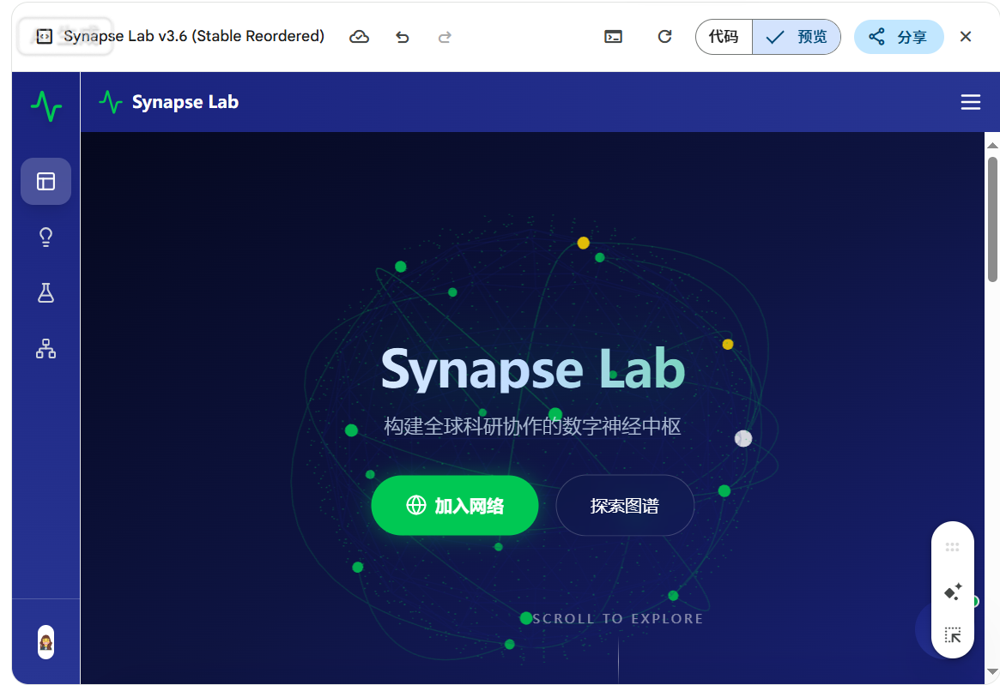
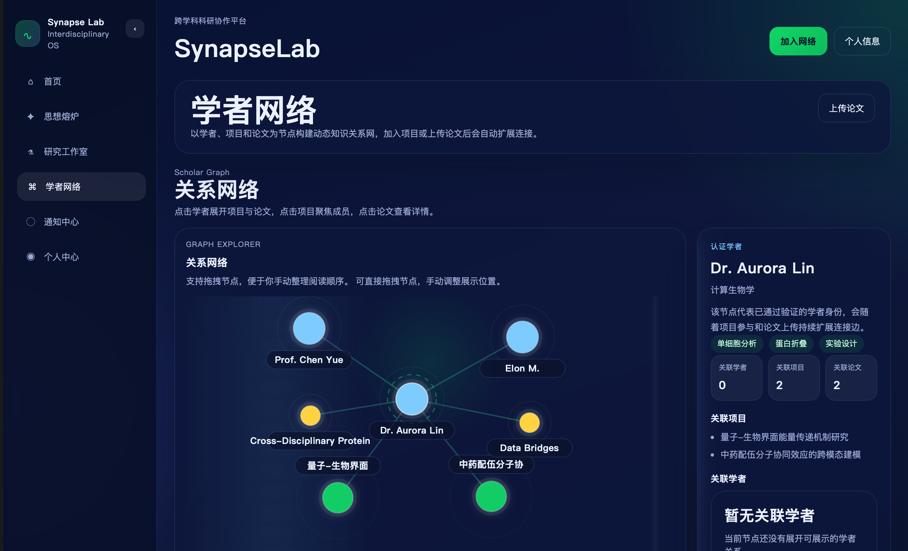

# SynapseLab

[中文说明](README.zh-CN.md)


SynapseLab is an interdisciplinary research collaboration platform built with `React + CloudBase`. It connects researchers, research ideas, projects, papers, and AI-assisted workflows in a unified knowledge network.

## Overview

SynapseLab is a full-stack application that includes:

- A production-ready React frontend
- CloudBase cloud functions for backend logic
- Database schemas, seed data, and security rules
- Local development and CloudBase deployment documentation
- Testing, operations, and maintenance guides

Live demo:
[SynapseLab Online](https://synapse-lab-1ghlp8bp8f847812-1257009542.tcloudbaseapp.com)

## What Problem It Solves

Research collaboration often suffers from three recurring issues:

- ideas are scattered and hard to validate continuously
- cross-disciplinary researcher connections are difficult to form
- projects, papers, and people are rarely shown as one structured network

SynapseLab is designed to turn those disconnected pieces into a dynamic knowledge graph so users can:

- publish research ideas
- discuss and refine hypotheses in the ideation space
- create and advance interdisciplinary projects
- join a scholar network and build graph relationships
- upload papers and connect them to researchers and projects

## Implemented Features

- landing page and platform introduction
- ideation page, idea details, and idea publishing flow
- research studio, project details, and project linking flow
- scholar graph and immersive full-screen graph mode
- notifications center and profile center
- CloudBase cloud functions and database integration
- CloudBase static hosting deployment
- project documentation for architecture, database, deployment, and testing

## UI Preview

### Home



The landing page introduces the platform concept, visual language, and the core message of connecting isolated ideas and accelerating innovation.

### Research Studio


The studio page focuses on project progress, interdisciplinary collaboration, and project workspace management.

### Scholar Graph



The scholar graph visualizes the relationship network between researchers, projects, and papers. It is one of the core interaction surfaces of the platform.

Screenshot notes:
[Screenshot Guide](docs/assets/screenshots/README.md)

## Repository Structure

```text
SynapseLab/
├── README.md
├── README.zh-CN.md
├── web/                # React frontend
├── cloudfunctions/     # CloudBase cloud functions
├── database/           # Schemas, seed data, and rules
├── deploy/             # Deployment docs and checklists
├── docs/               # Architecture, design, testing, and project docs
├── materials/          # Raw materials and reference files
├── tests/              # Test directory
└── scripts/            # Supporting scripts and notes
```

## Recommended Reading Order

1. [Project Overview](docs/00-项目总览.md)
2. [Requirements Analysis](docs/01-需求分析.md)
3. [System Architecture](docs/02-系统架构设计.md)
4. [Frontend Guide](web/README.md)
5. [CloudBase Deployment Guide](docs/10-CloudBase部署指南.md)

## Local Development

Run the frontend locally:

```bash
cd web
npm install
npm run dev
```

Build for production:

```bash
cd web
npm run build
```

## CloudBase-Related Directories

- [cloudfunctions](cloudfunctions/README.md): backend business logic implemented as cloud functions
- [database](database/README.md): collections, seed data, and production rules
- [deploy](deploy/README.md): deployment steps, environment samples, and launch checklists

## Documentation

[docs](docs/README.md) contains system design, database design, page design, deployment instructions, and testing-related documentation for the project.

## Use Cases

This repository is suitable for:

- continued SynapseLab feature development
- CloudBase deployment and product demos
- iterative work on an interdisciplinary research collaboration platform

If you are new to the codebase, start with the `README.md` files inside each major directory.
