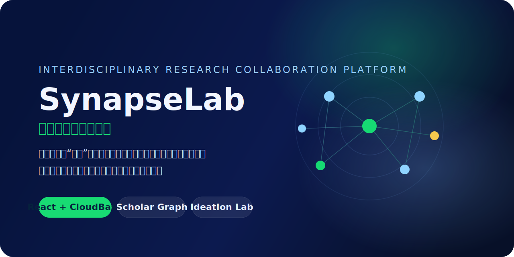

# SynapseLab



SynapseLab 是一个基于 `React + CloudBase` 的跨学科科研协作平台，用来把研究者、科研猜想、研究项目、论文成果和 AI 辅助能力连接到同一个系统里。

## 项目简介

这个项目不是单纯的前端页面集合，而是一套完整的毕业设计工程，包含：

- 可运行的 React 前端网站
- 基于 CloudBase 云函数的后端能力
- 数据库模型、初始化数据和权限规则
- 本地开发文档、CloudBase 部署文档
- 论文、答辩、测试相关材料

在线演示地址：
[SynapseLab Online](https://synapse-lab-1ghlp8bp8f847812-1257009542.tcloudbaseapp.com)

## 项目目标

传统科研协作往往存在三个问题：

- 灵感分散，猜想难以被持续讨论和验证
- 学者之间缺少跨学科连接，合作机会难以显现
- 项目、论文和研究人员之间缺少结构化关系展示

SynapseLab 的目标是把这些内容组织成一个动态知识网络，让用户可以：

- 发布科研猜想
- 在思想熔炉中讨论和筛选问题
- 创建并推进跨学科研究项目
- 加入学者网络，建立研究关系图谱
- 上传论文成果，并与项目和学者身份建立连接

## 当前已完成内容

- 首页与平台介绍
- 思想熔炉、猜想详情与发布流程
- 研究工作室、项目详情与项目关联
- 学者网络图谱与全屏图谱模式
- 通知中心、个人中心
- CloudBase 云函数与数据库基础接入
- CloudBase 静态托管上线
- 论文、测试、部署说明文档

## 核心页面预览说明

当前仓库已经适合展示以下几个核心界面：

- 首页：用于说明平台定位，强调“连接孤岛，催化创新”的核心理念
- 思想熔炉：用于展示科研猜想的发布、查看和讨论
- 研究工作室：用于展示跨学科项目的推进与协作
- 学者网络：用于展示学者、项目、论文之间的关系图谱

更详细的 GitHub 截图建议和文案说明见：
[GitHub 仓库截图说明](docs/23-GitHub仓库截图说明.md)

## 项目结构

```text
SynapseLab/
├── README.md
├── web/                # React 前端
├── cloudfunctions/     # CloudBase 云函数
├── database/           # 数据库模型、种子数据、权限规则
├── deploy/             # 部署说明与上线清单
├── docs/               # 论文、系统设计、测试、答辩材料
├── materials/          # 原始需求文档、素材与参考资料
├── tests/              # 测试目录
└── scripts/            # 辅助脚本说明
```

## 建议阅读顺序

1. [项目总览](docs/00-项目总览.md)
2. [需求分析](docs/01-需求分析.md)
3. [系统架构设计](docs/02-系统架构设计.md)
4. [前端说明](web/README.md)
5. [CloudBase 部署指南](docs/10-CloudBase部署指南.md)

## 本地运行

前端开发：

```bash
cd web
npm install
npm run dev
```

前端生产构建：

```bash
cd web
npm run build
```

## CloudBase 相关目录

- [cloudfunctions](cloudfunctions/README.md)：云函数目录，负责后端业务逻辑
- [database](database/README.md)：集合设计、种子数据、正式权限规则
- [deploy](deploy/README.md)：部署步骤、环境变量模板、上线检查清单

## 论文与答辩材料

论文和答辩文档集中在 [docs](docs/README.md) 中，已经包含：

- 需求分析
- 架构设计
- 数据库设计
- 页面设计
- CloudBase 部署指南
- 测试结果表
- 论文多稿版本
- 答辩讲稿与展示说明

## 适用场景

这个仓库既适合：

- 继续开发 SynapseLab 功能
- 整理毕业设计过程材料
- 进行 CloudBase 部署与演示
- 作为毕业论文和答辩的工程支撑

如果你是代码初学者，建议优先看各目录里的 `README.md`，这些内容已经按“小白也能理解”的方式整理过。
